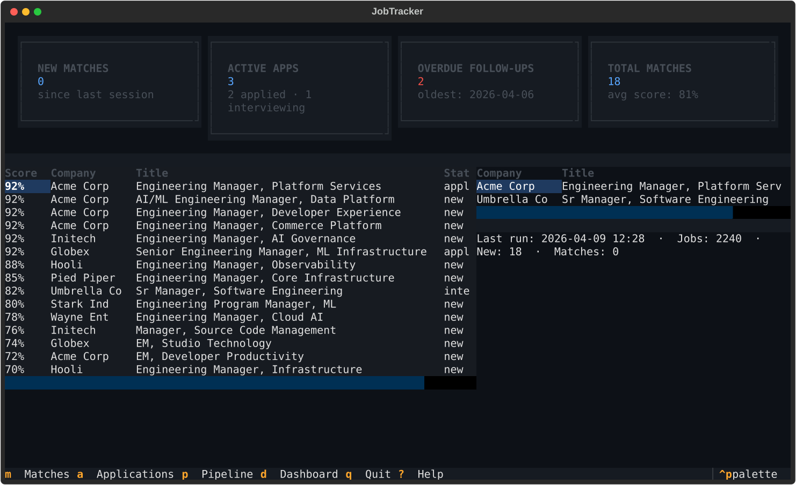
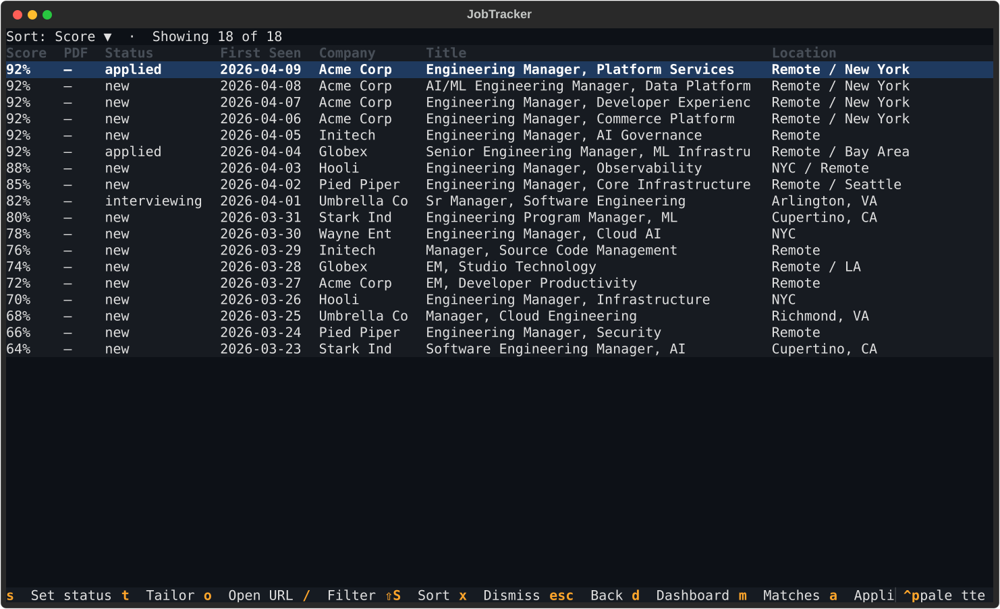
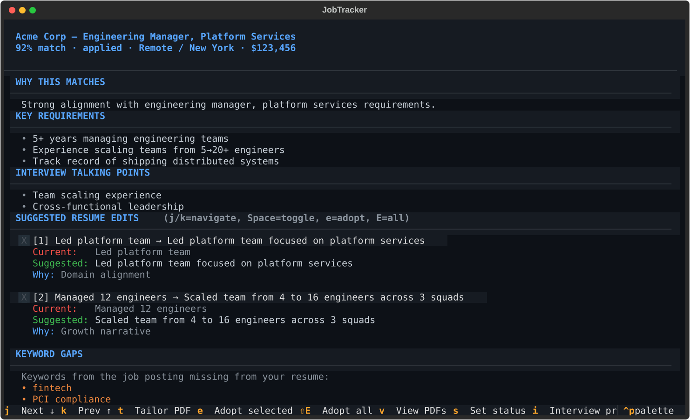
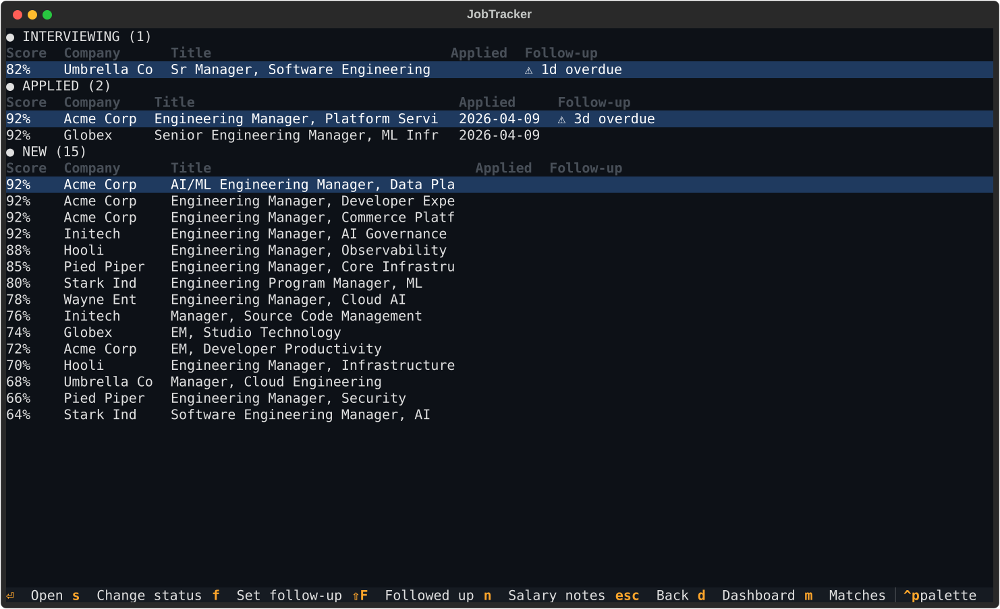
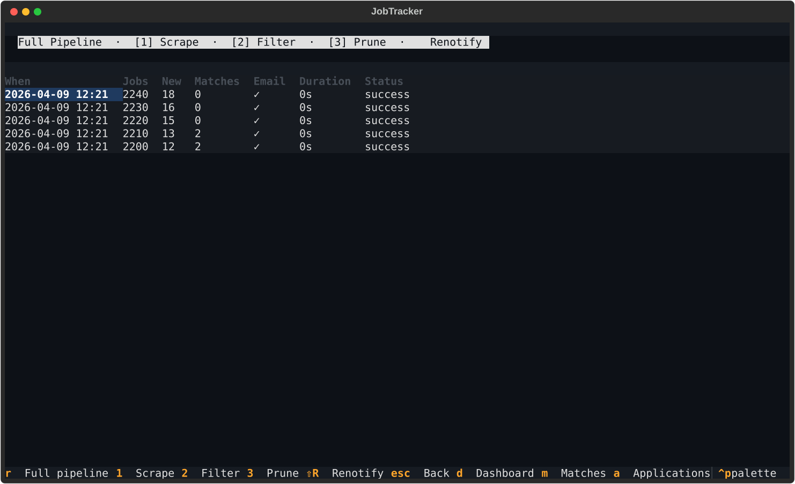

# jobTracker

Automated job tracker for engineering manager roles. Scrapes multiple job boards twice daily, filters with an LLM, tailors resumes and cover letters per job, and sends an email digest — all managed through a keyboard-driven terminal UI.

## Screenshots

### Dashboard
At-a-glance summary: new matches, active applications, overdue follow-ups, and pipeline status.



### Matches
Sortable, filterable list of all matched jobs. `j`/`k` or arrow keys to navigate, Enter/Space to drill in, `x` to dismiss.



### Job Detail
Full analysis with resume edit checkboxes, keyword gaps, company gripes, and one-key actions for tailoring, status changes, and interview prep. Color-coded sections with `j`/`k` navigation between edits.



### Applications
Applications grouped by status with follow-up tracking and overdue alerts.



### Pipeline
Trigger scrape/filter runs and view history. All operations run in the background with an animated spinner.



## What it does

1. **Scrape** — fetches new postings from Greenhouse (Dropbox, DataDog, Stripe, GitLab), Workday (Capital One, Netflix), Apple Jobs, and Google Careers
2. **Dedup** — merges duplicate listings that appear across multiple boards (same company + normalized title)
3. **Filter** — keyword pre-filter by title + location, then Claude Haiku scores each job for relevance against your resume
4. **Tailor** — Claude Sonnet analyzes the job description and suggests resume edits; generates tailored PDF resume and cover letter (analysis runs on-demand and is cached)
5. **Notify** — sends an HTML email digest with match scores, salary, location, direct links, and overdue follow-up reminders
6. **Track** — application status tracking with automatic follow-up dates and overdue reminders
7. **Interview prep** — Claude generates company research, role-specific questions, and talking points; patches your Obsidian note
8. **Dismiss** — hide irrelevant matches from all views with a single keystroke

## Setup

**Requirements:** Python 3.12+, [uv](https://docs.astral.sh/uv/), Anthropic API key

```bash
git clone https://github.com/drewmerc302/jobTracker
cd jobTracker
uv sync
cp .env.example .env  # fill in credentials
```

**.env** — copy `.env.example` and populate:

```
ANTHROPIC_API_KEY=sk-ant-...
SMTP_USER=you@gmail.com
SMTP_PASSWORD=your-app-password   # Gmail App Password, not your account password
```

## Usage

### TUI (default)

```bash
uv run jobtracker    # launches the terminal UI
```

**Navigation:** `d` Dashboard, `m` Matches, `a` Applications, `p` Pipeline, `q` Quit, `?` Help. Esc goes back. All keybindings shown in the footer.

**Key actions:**
- **Matches screen:** `j`/`k` or arrow keys to navigate, Enter/Space to open detail, `s` set status, `t` tailor, `o` open URL, `x` dismiss, `S` cycle sort, `/` filter
- **Job Detail:** `j`/`k` to navigate between edit checkboxes, Space to toggle, `e` adopt selected edits + generate PDF, `t` tailor without edits, `v` view existing PDFs, `s` set status, `i` interview prep, `g` company gripes (cached 30 days)
- **Applications:** Enter/Space to open detail, `s` change status, `f` set follow-up date, `F` mark followed up, `n` salary notes
- **Pipeline:** `r` refresh pipeline, `1` scrape, `2` filter, `3` prune stale, `R` renotify (sends top 10 matches)

### CLI (for automation)

All CLI flags continue to work for scripting and scheduled runs:

```bash
# Run a single step
uv run jobtracker --step scrape
uv run jobtracker --step filter
uv run jobtracker --step tailor
uv run jobtracker --step notify
uv run jobtracker --step dedup

# Dry run — scrape + filter only, no email
uv run jobtracker --dry-run

# Query tools
uv run jobtracker --list-matches
uv run jobtracker --show-job "Stripe:7609424"
uv run jobtracker --show-job "Stripe:7609424" --fresh   # force re-analysis
uv run jobtracker --tailor-job "Stripe:7609424" --adopt 1,3,5

# Prune stale listings
uv run jobtracker --prune-stale

# Application tracking
uv run jobtracker --status "Stripe:7609424" applied
uv run jobtracker --follow-ups
uv run jobtracker --followed-up "Stripe:7609424"

# Interview prep
uv run jobtracker --interview-prep "Stripe:7609424" --research
```

## Scheduling (macOS launchd)

A launchd plist runs the pipeline every 12 hours:

```bash
cp launchd/com.drewmerc.jobtracker.plist ~/Library/LaunchAgents/
launchctl load ~/Library/LaunchAgents/com.drewmerc.jobtracker.plist
```

Logs are written to `data/logs/` and automatically truncated at 1MB.

## Architecture

```
                    ┌─────────────────────────────┐
                    │     TUI (src/tui/)           │
                    │  Dashboard · Matches · Detail │
                    │  Applications · Pipeline      │
                    └──────────┬──────────────────┘
                               │ calls into
┌──────────────────────────────▼──────────────────────────────┐
│  Pipeline (src/pipeline.py)                                  │
│  scrape → dedup → filter → tailor → notify → obsidian        │
└──────────────────────────────┬──────────────────────────────┘
                               │
                    ┌──────────▼──────────┐
                    │  SQLite (src/db.py)  │
                    └─────────────────────┘
```

| Component | File | Description |
|-----------|------|-------------|
| TUI | `src/tui/app.py` | Textual app with 5 screens, global keybindings |
| Pipeline / CLI | `src/pipeline.py` | Arg parsing, step sequencing, TUI routing |
| Scrape | `src/steps/scrape.py` | Concurrent scraper runner |
| Dedup | `src/steps/dedup.py` | Merges duplicates by normalized title |
| Filter | `src/steps/filter.py` | Keyword filter + LLM scoring (Claude Haiku) |
| Tailor | `src/steps/tailor.py` | On-demand resume analysis (Claude Sonnet, cached) + PDF generation |
| Notify | `src/steps/notify.py` | HTML email digest with follow-up reminders |
| Obsidian | `src/steps/obsidian.py` | Markdown notes for job applications |
| Interview Prep | `src/steps/interview_prep.py` | LLM-generated prep patched into Obsidian notes |
| Database | `src/db.py` | SQLite with WAL mode, auto-migration |
| Config | `src/config.py` | Keywords, locations, company boards |

**Scrapers** (`src/scrapers/`): `greenhouse.py`, `workday.py`, `apple.py`, `google.py` — each implements `is_job_live(url)` for stale listing detection

**Database tables:** `jobs`, `matches` (with `dismissed_at`), `applications`, `status_history`, `runs`, `company_gripes`

**Application statuses:** `new`, `applied`, `interviewing`, `offer`, `rejected`, `withdrawn`, `closed`

**Job ID format:** `"Company:external_id"` — used in CLI commands and as DB foreign key

## Configuration

Edit `src/config.py` to tune:

- `keyword_patterns` — job titles to match
- `seniority_exclusions` — titles to exclude (VP, Staff, etc.)
- `acceptable_locations` — commute-range cities for in-office roles
- `greenhouse_boards` / `workday_companies` — which companies to scrape
- `relevance_threshold` — LLM score cutoff (default: 0.6)

## Development

```bash
uv run pytest          # run all tests
uv run pytest -x -q    # fail fast, quiet
```

Tests use fixture JSON files in `tests/fixtures/` — no live HTTP calls required. TUI screens are tested using Textual's async `run_test()` pilot API.

To regenerate README screenshots:

```bash
uv run python scripts/generate_screenshots.py
```

## Resume & PDF generation

Tailored PDFs are generated through [`resumekit`](../resumekit), a sibling repo wired in as an editable path dependency. It owns the resume version store at `~/.resume_versions/` and the Typst templates. Output PDFs are written to `output/<date>/`.

Requires `typst` (`brew install typst`) and Inter (`brew install --cask font-inter`). Run `uv run --directory ../resumekit rk doctor` to verify.
